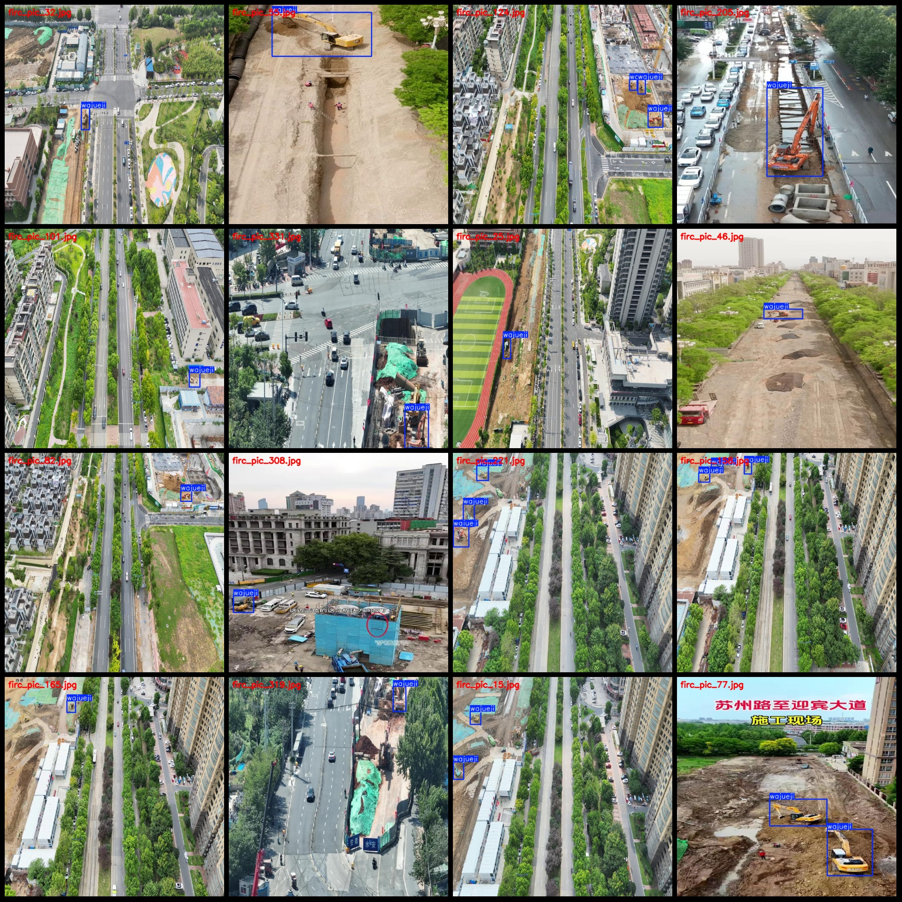
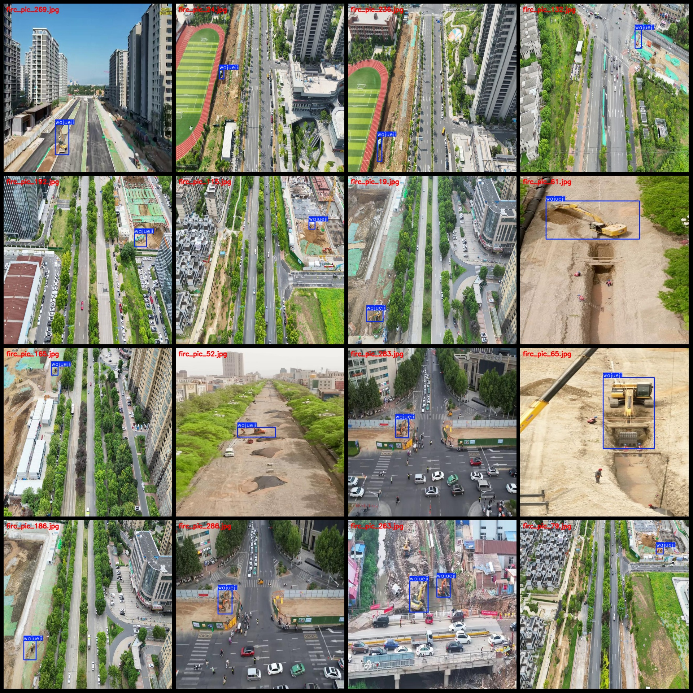

# Drone Perspective Aerial Photos and Crane Detection Dataset VOC+YOLO Format with 336 Images in 1 Category

Dataset Format: Pascal VOC format + YOLO format (txt file without split paths, only containing jpg images along with corresponding VOC format xml files and YOLO format txt files)
Number of Images (jpg file count): 336
Number of Annotations (xml file count): 336
Number of Annotations (txt file count): 336
Number of Annotation Categories: 1
Annotation Category Name: ["wajueji"]
Box Count per Category:  
wajueji Box Count = 513
Total Box Count: 513
Images per Category:  
wajueji Images = 336
Image Resolution: 640x640
Annotation Tool: labelImg
Annotation Rules: Mark boxes around categories
Important Notice: The dataset does not have a separate training/validation/test split, so users need to manually divide it.
Special Remark: This dataset does not guarantee the accuracy of models or weights files trained on it.
Image Preview:

Annotation Example:

## Images

Here is a pay link on Stripe ( https://buy.stripe.com/3cs8yP7sY87d0vu9AB ). Please contact me lonlonago@foxmail.com after funding $89, and I will send you a complete data files , thank you!

